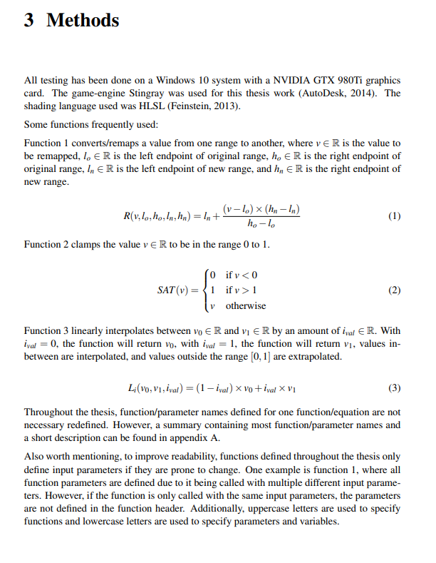
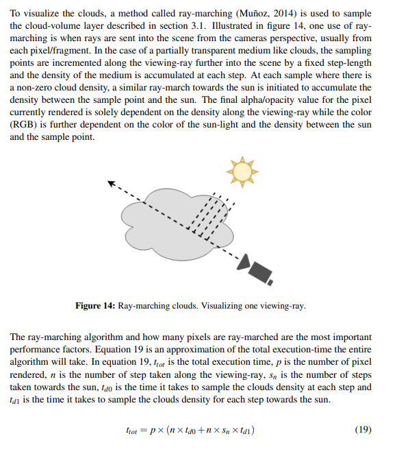
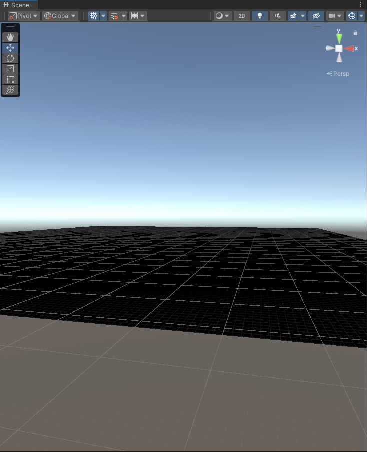
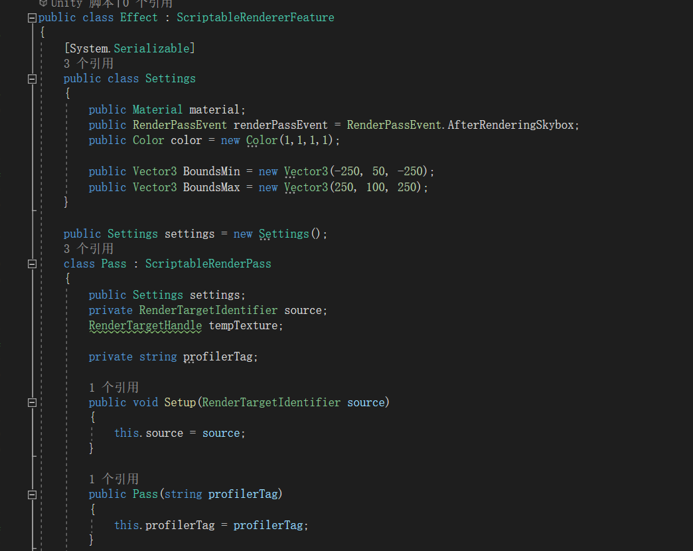

# COMP3180 Final Project

Included is a rough timeline below. Fill this in from week to week to show your progress throughout semester.

<details>
  <summary>Markdown formatting tips (Click to expand)</summary>
  Below are a number of tips for adding images and other formatting to your journal. We recommend you give them all a go. You can remove this section from your journal when you are done with it.

  ## Inserting images
  You can (and should!) insert images into your journal. To do so, place the images inside a folder within your repo and insert them using the following template, replacing text in "<>" appropriately:
  ```
  
  ```
  For example:
  ```
  
  ```
  ## Inserting Quotes
  Quotes can be a useful way to add sections from your readings into your journal for reference later. To add them, place a ">" marker in front of each line (or using `<br>` to seperate them). Example:

  > This is the first line of my awesome quote!<br>And here is another line! How cool!

  No marker here, so the quote is broken. But I can bring it back...
  > Like this!

  ## Inserting Code
  Code snippets can be a good way to place algorithms, formulas or other such things into your documentation for illustrative purposes (or if your project requires installation instructions). You can insert code by placing three backticks (```) above and below the code breakout. Like this:

  ```
  if (noCoffee)
  {
    coffeePot.refill();
  }
  ```
  If you want to add a very short snippet of code into a paragraph, you can instead use single Backtick, `Like this!`.

  Please let us know if you need help doing anything else in Markdown!
</details>

## Week 1 - Selecting a Project

Topic: Graphics

My project idea is to create a highly realistic cloud effect in Unity, aiming to closely mimic real world appearance and behavior to enhance the visual experience.

## Week 2 - Narrowing Focus & Tool Familiarisation

https://www.bilibili.com/video/BV1gU4y1J7Ak/?spm_id_from=333.337.search-card.all.click&vd_source=5772d9c190ace46357a22c0229a07662

https://www.diva-portal.org/smash/get/diva2:1223894/FULLTEXT01.pdf

Done a cloud via Shader Grapgh and watch a paper for clouds

## Week 3 - Research (Reading & Prototyping)

I did a lot of research this week, including HLSL language, Shader Graph, Compute Shader, and some Ray Marching. I realized that if I want to complete my volumetric cloud project, I need to learn HLSL to generate 3D cloud noise, and then use ScriptableObject to classify different cloud types. Ray Marching is needed for calculating light scattering within the clouds, and I also need to learn Compute Shader to perform parallel shader computations. Since the clouds are generated randomly, they will heavily utilize GPU resources, so Compute Shader is necessary for optimization. After doing so much research and calculation, I am now a bit confused because I'm not sure if I can complete all of this within the given timeframe.

https://learn.unity.com/

https://docs.unity3d.com/2020.1/Documentation/Manual/SL-Reference.html

https://www.youtube.com/watch?v=hXYOlXVRRL8

https://docs.unity3d.com/cn/2019.4/Manual/ShaderTut1.html

## Week 4 - Research (Reading & Prototyping)

This week my primary focus was on deepening my understanding of the technologies and techniques invvolved in volumetric cloud generation. To achieve this, i completed the following tasks:

> Preparation of Presentation: i completed my presentation slides, which detail the current progress of my project, including the challenges and solutions i've encountered so far in generating realistic volumetric clouds in unity.

> In-Depth Research: i dedicated significant time to reading various articles and watching educational videos related to volumetric cloud generation. This included materials on:

    · Advanced noise algorithms such as Perlin and Worley noise.



    · Techniques for realistic light scattering within clouds using Ray Matching



Through this research, i gained a clearer understanding of the potential capabilities of these techniques and the time required to implement them effectively in my project.

## Week 5 - Presentations (& research/rescoping)

This week, I continued to work on the volumetric cloud project using Unity's URP (Universal Render Pipeline). After assessing the remaining time for this semester and considering my own capabilities, I decided to slightly reduce the difficulty of the project.

Initially, my plan was to use a Compute Shader to parallelly calculate the rendering of every point inside the volumetric cloud. However, after extensively studying Compute Shader, I realized that the amount of learning required to achieve this goal before the semester ends is too large. Therefore, I have adjusted the project direction and decided not to generate 3D noise in real-time. Instead, I will use a pre-generated 3D noise texture. Specifically, I plan to add a new rendering effect within the URP pipeline and apply the pre-generated 3D noise texture to achieve the volumetric cloud effect.

This adjustment allows me to complete the project within the limited time while ensuring the quality of the final outcome. My current goal is to develop a framework that can be published on the Unity Asset Store for other developers to use. Through this process, I aim to learn the HLSL language and gain knowledge that I wouldn't typically encounter in school, such as rendering pipeline programming.

Overall, this week's work has given me a clearer understanding of the final direction of the project and helped me find a balance between learning and practice. Moving forward, I will continue to delve into the features of URP and gradually refine the implementation of the volumetric cloud effect.

## Week 6 - Presentations (& research/rescoping)

This week, I began learning about ScriptableRendererFeature and successfully achieved some initial results. Integrating this feature into the URP pipeline has allowed me to make significant progress toward implementing the volumetric cloud effect.





The focus was on understanding how ScriptableRendererFeature works within the URP, and I spent time experimenting with its capabilities to create custom rendering passes. These experiments are already showing promise, and I feel more confident in applying this technique to the volumetric cloud project moving forward.

Next week, I plan to continue refining the use of ScriptableRendererFeature and further enhance the cloud effect, aiming to bring it closer to the final version that can be shared on the Unity Asset Store.

## Week 7 - Research Report Finalisation

This week was focused on finalizing the research report that documents the progress and findings from the previous weeks. I reviewed all the materials I gathered over the past few weeks, including my experiments with volumetric clouds, ScriptableRendererFeature, and other related technologies. The goal was to consolidate this information into a comprehensive document that not only tracks the technical progress but also reflects the challenges I faced and how I overcame them.

During this process, I highlighted key learnings, such as the decision to shift from real-time 3D noise generation to pre-generated textures. Additionally, I refined my understanding of how volumetric rendering works within Unity URP, which will serve as a foundation for future project development. This week was all about reflection and documentation, ensuring that all the research I had done so far was properly captured for later use.

## Week 8 - Project Development

This week, I resumed active development on the volumetric cloud project. After the research consolidation, I returned to working with ScriptableRendererFeature and began integrating the pre-generated noise textures into the cloud rendering system.

I focused on refining the cloud appearance by adjusting the noise textures, tweaking the light scattering calculations, and improving the overall visual quality. I also started optimizing the performance of the system, ensuring that the clouds rendered smoothly even on mid-range hardware. By the end of the week, I had a more polished version of the cloud effect, which felt closer to the final goal.

## Mid-semster break 1 - Continued R&D

During the first mid-semester break, I focused on writing and optimizing the core code for cloud rendering, specifically the `sampleDensity` function that calculates the density of the cloud at a given position. Here is the implementation I completed:
```

// Function to sample the cloud density at a given position
float sampleDensity(float3 pos)
{
    // Calculate the UVW coordinates for the noise texture based on cloud scale and wind speed
    float3 uvw = pos * _CloudScale * 0.001 + _Wind.xyz * 0.1 * _Time.y * _CloudScale;

    // Calculate the cloud boundaries and determine distance from the edges for smooth fading
    float3 size = _BoundsMax - _BoundsMin;
    float3 boundsCentre = (_BoundsMin + _BoundsMax) * 0.5f;

    // Compute edge distances in X, Y, and Z directions to ensure smooth cloud edge fading
    float dstFromEdgeX = min(_containerEdgeFadeDst, min(pos.x - _BoundsMin.x, _BoundsMax.x - pos.x));
    float dstFromEdgeY = min(_cloudSmooth, min(pos.y - _BoundsMin.y, _BoundsMax.y - pos.y));
    float dstFromEdgeZ = min(_containerEdgeFadeDst, min(pos.z - _BoundsMin.z, _BoundsMax.z - pos.z));

    // Calculate the edge weight for fading, ensuring that the cloud edges gradually disappear
    float edgeWeight = min(dstFromEdgeZ, dstFromEdgeX) / _containerEdgeFadeDst;

    // Sample the base cloud density from the shape noise texture
    float4 shape = _ShapeNoise.SampleLevel(sampler_ShapeNoise, uvw.xz, 0);
    float density = max(0, shape.x - _DensityThreshold) * _DensityMultiplier;

    // Combine the edge fading effect and Y direction smoothing to return the final density value
    return density * edgeWeight * (dstFromEdgeY / _cloudSmooth);
}

```

This function computes cloud density by blending noise texture data with boundary conditions, ensuring that the cloud edges fade smoothly. By learning and applying these techniques, I was able to further optimize the visual quality of the clouds, particularly in handling edge fading and noise generation. Additionally, I studied how noise textures can be used to control cloud shapes effectively.

I also focused on the logic for stepping through light propagation within the cloud:
```

// Initialize ray marching parameters for stepping through the cloud
float dstTravelled = 0;
float stepSize = dstInsideBox / _NumSteps;
float dstLimit = min(depth - dstToBox, dstInsideBox);

// Accumulate cloud density
float totalDensity = 0;
while(dstTravelled < dstLimit)
{
    // Calculate the current position of the ray inside the cloud
    float3 rayPos = rayOrigin + rayDir * (dstToBox + dstTravelled);
    // Sample the density at the current position and accumulate it
    totalDensity += sampleDensity(rayPos) * stepSize;
    dstTravelled += stepSize;
}

```

This logic calculates the light transmittance through the cloud using ray marching and density accumulation, leading to a more realistic light scattering effect within the clouds. Implementing and testing this section significantly improved the overall visual quality of the clouds while maintaining performance optimization.

## Mid-semster break 1 - Continued R&D

During the second mid-semester break, I continued optimizing and expanding the cloud rendering system, while also diving deeper into the underlying theory. I completed the following key sections and further refined the implementation:

```

public Texture2D CloudShapeTexure;

[Header("Light Setting")]
public int LightSteps = 15;

[Header("Container Setting")]
public Vector3 ContainerSizeMin = new Vector3(-250, 50, -250);
public Vector3 ContainerSizeMax = new Vector3(250, 100, 250);
public float ContainerEdgeFadeDistance = 45;

[Header("Cloud Setting")]
public float CloudSize = 1;
public float CloudEdgeSmooth = 5;
public Vector3 Wind = new Vector3(1, 0, 0);
public float CloudDensityThreshold = 0.25f;
public float CloudDensityThickMuliplier = 1;

```

These parameters allow me to flexibly adjust the appearance and behavior of the clouds. For example, the ContainerSizeMin and ContainerSizeMax values define the area in which clouds are generated, while Wind determines the direction and speed of cloud movement. The CloudDensityThreshold and CloudDensityThickMuliplier control the density and thickness of the clouds.

By fine-tuning these settings, I was able to create a wider variety of cloud types and build a more robust foundation for future extensions. I also explored how to use Unity's ScriptableObject to store and manage these parameters, ensuring that the cloud rendering system remains modular and reusable.

## Week 9 - Project Development

This week, I completed the final stages of developing realistic volumetric clouds within Unity's Universal Render Pipeline (URP). The work involved finalizing all shader development and writing the necessary code for generating the clouds. The volumetric cloud system now fully integrates into the render pipeline, allowing for dynamic cloud generation with customizable parameters such as density, lighting, and wind. A key challenge was ensuring that the system is optimized for real-time rendering without sacrificing visual fidelity, which I resolved through efficient shader techniques and parameter tuning.

```

float lightmarch(float3 position) {
  float3 dirToLight = _WorldSpaceLightPos0.xyz;
  float dstInsideBox = rayBoxDst(_ContainerMin, _ContainerMax, position, 1 / dirToLight).y;
                
  float stepSize = dstInsideBox / _numStepsLight;
  float totalDensity = 0;

  for (int step = 0; step < _numStepsLight; step ++) {
    position += dirToLight * stepSize;
    totalDensity += max(0, sampleDensity(position) * stepSize);
  }
  
  return _darknessThreshold + exp(-totalDensity * _lightAbsorptionTowardSun) * (1 - _darknessThreshold);
}

```

```

while (dstTravelled < min(depth - dstToBox, dstInsideBox)) {
  rayOrigin = entryPoint + rayDir * dstTravelled;
  float density = sampleDensity(rayOrigin);
                    
  if (density > 0) {
    float lightTransmittance = lightmarch(rayOrigin);
    lightEnergy += density * stepSize * transmittance * lightTransmittance * 0.5f;
    transmittance *= exp(-density * stepSize * _lightAbsorptionThroughCloud);
                    
    if (transmittance < 0.1) {
      break;
    }
  }
  dstTravelled += stepSize;
}

```


## Week 10 - Project Development

In Week 10, I transitioned the cloud parameter handling system to use ScriptableObject, which made the cloud generation process more modular and customizable. Each cloud type, such as Cirrus, Cumulus, and Stratus, now has its own ScriptableObject, storing specific parameters like cloud color, wind speed, and density. This week also involved integrating these ScriptableObject instances into the CloudRenderPipeline, automating the loading and adjustment of cloud settings at runtime. This improvement will make future cloud modifications easier and more efficient. I also worked on refining the wind effects, cloud movement, and light scattering for each cloud type to enhance realism.

```

[CreateAssetMenu(fileName = "CloudTypeData", menuName = "ScriptableObjects/CloudTypeData", order = 1)]
public class CloudTypeScriptableObject : ScriptableObject
{
    [Header("Cloud Settings")]
    [Tooltip("Cloud color")]
    public Color CloudColor = new Color(1, 1, 1, 1);
    [Tooltip("Wind direction and speed")]
    public Vector3 Wind = new Vector3(1, 0, 0);
    [Tooltip("Controlling how detailed the cloud rendering is.")]
    [Range(10, 50)] public int Steps = 30;
    [Tooltip("Number of light steps affecting cloud light scattering.")]
    [Range(8, 30)] public int LightSteps = 15;
    [Tooltip("The overall size of the cloud in the scene.")]
    [Range(1, 15)] public float CloudScale = 1;
    [Tooltip("Controls the smoothness of cloud edges.")]
    [Range(1, 50)] public float CloudSmooth = 5;
    [Tooltip("Amount of light absorbed as it passes through the cloud.")]
    [Range(0, 1)] public float LightAbsorptionThroughCloud = 0.15f;
    [Tooltip("Distance over which the cloud fades at the edges.")]
    [Range(50, 100)] public float ContainerEdgeFadeDst = 45;
    [Tooltip("The threshold for cloud density.")]
    [Range(0.1f, 0.5f)] public float DensityThreshold = 0.25f;
    [Tooltip("Multiplier for cloud density")]
    [Range(1, 3)] public float DensityMultiplier = 1;
    [Tooltip("Controls how much light is absorbed when looking toward the sun.")]
    [Range(0.1f, 0.35f)] public float LightAbsorptionTowardSun = 0.25f;
    [Tooltip("Controls the darkness threshold for cloud shadows.")]
    [Range(0.1f, 0.25f)] public float DarknessThreshold = 0.1f;
    [Tooltip("Cloud transparency.")]
    [Range(0.7f, 1)] public float alpha = 1;

    [Header("Detail Cloud Settings")]
    [Tooltip("Wind of detailed cloud.")]
    public Vector3 DetailCloudWind = new Vector3(0.5f, 0, 0);
    [Tooltip("Weight of detailed cloud.")]
    [Range(0, 1)] public float detailCloudWeight = 0.24f;
    [Tooltip("Scale for the detailed cloud.")]
    [Range(1, 3)] public float DetailCloudScale = 1;
}

```

```

    public static void SetCloudParameters(CloudType cloudType, CloudSettings cloudSettings, CloudTypeScriptableObject[] cloudTypeData)
    {
        int id = (int)cloudType;

        cloudSettings.CloudColor = cloudTypeData[id].CloudColor;
        cloudSettings.Steps = cloudTypeData[id].Steps;
        cloudSettings.LightSteps = cloudTypeData[id].LightSteps;
        cloudSettings.CloudScale = cloudTypeData[id].CloudScale;
        cloudSettings.CloudSmooth = cloudTypeData[id].CloudSmooth;
        cloudSettings.Wind = cloudTypeData[id].Wind;
        cloudSettings.LightAbsorptionThroughCloud = cloudTypeData[id].LightAbsorptionThroughCloud;
        cloudSettings.ContainerEdgeFadeDst = cloudTypeData[id].ContainerEdgeFadeDst;
        cloudSettings.DensityThreshold = cloudTypeData[id].DensityThreshold;
        cloudSettings.DensityMultiplier = cloudTypeData[id].DensityMultiplier;
        cloudSettings.LightAbsorptionTowardSun = cloudTypeData[id].LightAbsorptionTowardSun;
        cloudSettings.DarknessThreshold = cloudTypeData[id].DarknessThreshold;
        cloudSettings.alpha = cloudTypeData[id].alpha;

        cloudSettings.detailCloudWeight = cloudTypeData[id].detailCloudWeight;
        cloudSettings.DetailCloudScale = cloudTypeData[id].DetailCloudScale;
        cloudSettings.DetailCloudWind = cloudTypeData[id].DetailCloudWind;
    }

```

## Week 11 - Project Evaluation

In this week i have make a Editor scrite to let the ScriptableObject to show on the inspector

```

[CustomEditor(typeof(Container))]
public class ContainerEditor : Editor
{
    public override void OnInspectorGUI()
    {
        Container container = (Container)target;

        DrawDefaultInspector();

        string cloudTypeName = container.cloudType.ToString();
        string[] assetGuids = AssetDatabase.FindAssets(cloudTypeName + " t:CloudTypeScriptableObject");

        if (assetGuids.Length > 0)
        {
            string assetPath = AssetDatabase.GUIDToAssetPath(assetGuids[0]);
            CloudTypeScriptableObject selectedCloudData = AssetDatabase.LoadAssetAtPath<CloudTypeScriptableObject>(assetPath);

            if (selectedCloudData != null)
            {
                EditorGUILayout.Space();
                EditorGUILayout.LabelField("Cloud Settings for " + cloudTypeName, EditorStyles.boldLabel);

                selectedCloudData.CloudColor = EditorGUILayout.ColorField("Cloud Color", selectedCloudData.CloudColor);
                selectedCloudData.Steps = EditorGUILayout.IntSlider("Steps", selectedCloudData.Steps, 10, 50);
                selectedCloudData.LightSteps = EditorGUILayout.IntSlider("Light Steps", selectedCloudData.LightSteps, 8, 30);
                selectedCloudData.CloudScale = EditorGUILayout.Slider("Cloud Scale", selectedCloudData.CloudScale, 1, 15);
                selectedCloudData.CloudSmooth = EditorGUILayout.Slider("Cloud Smooth", selectedCloudData.CloudSmooth, 1, 50);
                selectedCloudData.Wind = EditorGUILayout.Vector3Field("Wind", selectedCloudData.Wind);
                selectedCloudData.LightAbsorptionThroughCloud = EditorGUILayout.Slider("Light Absorption Through Cloud", selectedCloudData.LightAbsorptionThroughCloud, 0, 1);
                selectedCloudData.ContainerEdgeFadeDst = EditorGUILayout.Slider("Container Edge Fade Distance", selectedCloudData.ContainerEdgeFadeDst, 50, 100);
                selectedCloudData.DensityThreshold = EditorGUILayout.Slider("Density Threshold", selectedCloudData.DensityThreshold, 0.1f, 0.5f);
                selectedCloudData.DensityMultiplier = EditorGUILayout.Slider("Density Multiplier", selectedCloudData.DensityMultiplier, 1, 3);
                selectedCloudData.LightAbsorptionTowardSun = EditorGUILayout.Slider("Light Absorption Toward Sun", selectedCloudData.LightAbsorptionTowardSun, 0.1f, 0.35f);
                selectedCloudData.DarknessThreshold = EditorGUILayout.Slider("Darkness Threshold", selectedCloudData.DarknessThreshold, 0.1f, 0.25f);
                selectedCloudData.alpha = EditorGUILayout.Slider("Alpha", selectedCloudData.alpha, 0.7f, 1);
                selectedCloudData.detailCloudWeight = EditorGUILayout.Slider("Detail Cloud Weight", selectedCloudData.detailCloudWeight, 0, 1);
                selectedCloudData.DetailCloudScale = EditorGUILayout.Slider("Detail Cloud Scale", selectedCloudData.DetailCloudScale, 1, 3);
                selectedCloudData.DetailCloudWind = EditorGUILayout.Vector3Field("Detail Cloud Wind", selectedCloudData.DetailCloudWind);

                EditorUtility.SetDirty(selectedCloudData);
            }
            else
            {
                EditorGUILayout.HelpBox("No Cloud Data available for this CloudType.", MessageType.Warning);
            }
        }
        else
        {
            EditorGUILayout.HelpBox("No CloudTypeScriptableObject found for " + cloudTypeName, MessageType.Warning);
        }
    }
}

```

After that i make a editor window and create two button and some text to let people can use this tool easy in unity

```

public class SetUp : EditorWindow
{
    [MenuItem("Tools/Setup Cloud Render Pipeline")]
    public static void ShowWindow()
    {
        GetWindow<SetUp>("Cloud Render Pipeline Setup");
    }

    void OnGUI()
    {
        GUILayout.Label("Cloud Render Pipeline Setup", EditorStyles.boldLabel);
        EditorGUILayout.HelpBox("This tool allows you to set up a Cloud Render Pipeline feature and a CloudContainer in the scene. \n\n"
            + "1. Click 'Create' to add a cloud rendering feature to your Universal Render Pipeline.\n"
            + "2. Click 'Remove' to remove the feature and the CloudContainer from the scene.\n\n"
            + "Run the game every time after you have Click on 'Create' and 'Remove'", MessageType.Info);
        GUILayout.BeginHorizontal();
        if (GUILayout.Button("Create"))
        {
            var currentRenderPipeline = GraphicsSettings.currentRenderPipeline;

            if (currentRenderPipeline is UniversalRenderPipelineAsset)
            {
                AddCloudRenderPipeline();
                CreateCloudContainer();
            }
            else
            {
                Debug.LogError("The Render Pipeline you are using is not Universal Render Pipeline, please switch to URP.");
            }
        }

        if (GUILayout.Button("Remove"))
        {
            var currentRenderPipeline = GraphicsSettings.currentRenderPipeline;

            if (currentRenderPipeline is UniversalRenderPipelineAsset)
            {
                RemoveCloudRenderPipeline();
                RemoveCloudContainer();
            }
            else
            {
                Debug.LogError("The Render Pipeline you are using is not Universal Render Pipeline, please switch to URP.");
            }
        }

        GUILayout.EndHorizontal();
    }

    void AddCloudRenderPipeline()
    {
        var pipelineAsset = (UniversalRenderPipelineAsset)GraphicsSettings.currentRenderPipeline;

        FieldInfo rendererDataListField = typeof(UniversalRenderPipelineAsset).GetField("m_RendererDataList", BindingFlags.NonPublic | BindingFlags.Instance);
        ScriptableRendererData[] rendererDataList = (ScriptableRendererData[])rendererDataListField.GetValue(pipelineAsset);

        if (rendererDataList != null && rendererDataList.Length > 0)
        {
            ScriptableRendererData rendererData = rendererDataList[0];

            bool alreadyAdded = false;
            foreach (var feature in rendererData.rendererFeatures)
            {
                if (feature is CloudRenderPipeline)
                {
                    alreadyAdded = true;
                    break;
                }
            }

            if (!alreadyAdded)
            {
                var cloudFeature = ScriptableObject.CreateInstance<CloudRenderPipeline>();

                rendererData.rendererFeatures.Add(cloudFeature);
                AssetDatabase.AddObjectToAsset(cloudFeature, pipelineAsset);

                Debug.Log("CloudRenderPipeline is added to your render pipeline");

                EditorUtility.SetDirty(rendererData);
                AssetDatabase.SaveAssets();
                AssetDatabase.Refresh();
            }
            else
            {
                Debug.LogWarning("CloudRenderPipeline is already in your render pipeline");
            }
        }
        else
        {
            Debug.LogError("There is no Renderer Data");
        }
    }

    void RemoveCloudRenderPipeline()
    {
        var pipelineAsset = (UniversalRenderPipelineAsset)GraphicsSettings.currentRenderPipeline;

        FieldInfo rendererDataListField = typeof(UniversalRenderPipelineAsset).GetField("m_RendererDataList", BindingFlags.NonPublic | BindingFlags.Instance);
        ScriptableRendererData[] rendererDataList = (ScriptableRendererData[])rendererDataListField.GetValue(pipelineAsset);

        if (rendererDataList != null && rendererDataList.Length > 0)
        {
            ScriptableRendererData rendererData = rendererDataList[0];

            for (int i = 0; i < rendererData.rendererFeatures.Count; i++)
            {
                if (rendererData.rendererFeatures[i] is CloudRenderPipeline)
                {
                    rendererData.rendererFeatures.RemoveAt(i);
                    Debug.Log("CloudRenderPipeline has been removed from your render pipeline");

                    EditorUtility.SetDirty(rendererData);
                    AssetDatabase.SaveAssets();
                    AssetDatabase.Refresh();

                    break;
                }
            }
        }
        else
        {
            Debug.LogError("There is no Renderer Data to remove CloudRenderPipeline");
        }
    }

    void CreateCloudContainer()
    {
        GameObject cloudContainer = new GameObject("CloudContainer");

        cloudContainer.AddComponent<Container>();

        Debug.Log("The scene has added a CloudContainer with Cloud controler");
    }

    void RemoveCloudContainer()
    {
        GameObject cloudContainer = GameObject.Find("CloudContainer");
        if (cloudContainer != null)
        {
            DestroyImmediate(cloudContainer);
            Debug.Log("CloudContainer has been removed from the scene");
        }
        else
        {
            Debug.LogWarning("No CloudContainer found in the scene to remove");
        }
    }
}


```

Then i export the whole project to a package. And also make a questionnaire for my game.

https://forms.gle/wwpWyaoLS5ecAxaq7

## Week 12 - Project Evaluation

## Week 13 - Project Report & Deliverables Finalisation

